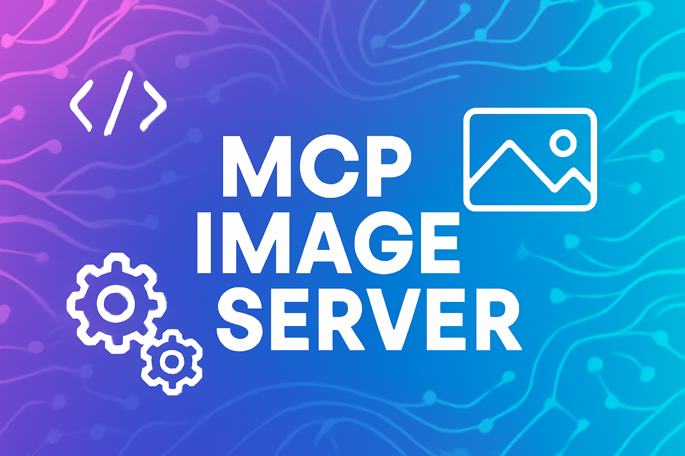

# MCP Image Server



MCP server in TypeScript for generating custom images and icons via AI (DALL-E 3), delivering files in `.png`, `.svg`, `.ico`, and other formats. Compatible with MCP Client, ready for integration by MCP agents, and for publishing on [https://mcp.so/](https://mcp.so/). Cross-platform, executable via `npx`.

## Features

- Custom image generation via DALL-E 3 (OpenAI)
- Delivers files in `.png`, `.svg` (embedded base64 image), and `.ico` (real conversion)
- MCP tools documented with usage examples accessible via resource
- Resource for querying supported formats
- Ready for integration with MCP Client, agents, and Vibe Coding flows
- Cross-platform (Windows/Linux/Mac), ready to run via `npx`

## Project Structure

- `src/index.ts`: Main implementation of the MCP server, tools, and resources
- `package.json`: Project configuration, dependencies, and cross-platform scripts
- `README.md`: This document
- `test-mcp-client.js`: MCP Client integration test script
- `tsconfig.json`: TypeScript configuration
- `sample_config.json`: Example MCP Client configuration

## How to configure MCP Client to use this server

Add the following configuration to your MCP servers file (example for `sample_config.json`):

```json
{
    "servers": {
        "mcp-image-server": {
            "type": "stdio",
            "command": "npx",
            "args": [
                "-y",
                "@ricardopera/mcp-image-server@latest"
            ],
            "env": {
                "OPENAI_API_KEY": "YOUR_OPENAI_API_KEY_HERE"
            }
        }
    }
}
```

This allows you to run the image server directly via npx, with no prior installation, and sets the required environment variable for OpenAI authentication.

## How to run locally

1. Install dependencies:

   ```sh
   npm install
   ```

2. Build the project:

   ```sh
   npm run build
   ```

3. Set the `OPENAI_API_KEY` environment variable with your OpenAI key:

   - On Windows (PowerShell):

     ```sh
     $env:OPENAI_API_KEY="your-key-here"
     ```

   - On Linux/Mac:

     ```sh
     export OPENAI_API_KEY="your-key-here"
     ```

4. Run via npx:

   ```sh
   npx mcp-image-server
   ```

## How to submit to MCP.so

1. Make sure the project is built, tested, and documented
2. Follow the submission instructions at [https://mcp.so/](https://mcp.so/)

## Progress and Documentation

- [x] Initial project structure
- [x] MCP server implementation
- [x] Real DALL-E 3 integration
- [x] Conversion and delivery of files in `.png`, `.svg`, `.ico` formats
- [x] MCP tools documented and annotated
- [x] Usage examples resource (`resource://tool-examples`)
- [x] Supported formats resource (`formats://supported`)
- [x] Integration tests with MCP Client
- [ ] Automated tests and edge case validation
- [ ] Final detailed documentation (examples, troubleshooting)

---

## Visual Examples

Below are real examples of images generated by the MCP Image Server tools. All images were automatically saved in the `examples/` folder using the `fileName` and `directory` parameters of the tools.

### Example 1: Minimalist rocket icon (PNG)

Prompt used:

```json
{
  "prompt": "minimalist rocket icon transparent background",
  "format": "png",
  "fileName": "rocket-icon",
  "directory": "examples"
}
```

Result:


---

### Example 2: Blue circular logo with letter A (SVG)

Prompt used:

```json
{
  "prompt": "blue circular logo with letter A",
  "format": "svg",
  "fileName": "blue-logo-letter-a",
  "directory": "examples"
}
```

Result:


---

### Example 3: Golden star icon (ICO)

Prompt used:

```json
{
  "prompt": "golden star icon",
  "format": "ico",
  "fileName": "golden-star",
  "directory": "examples"
}
```

Result:


---

### Example 4: Yellow star favicon (ICO)

Prompt used:

```json
{
  "prompt": "yellow star favicon transparent background",
  "fileName": "yellow-star-favicon",
  "directory": "examples"
}
```

Result:


---

### Example 5: Red heart icon (SVG)

Prompt used:

```json
{
  "prompt": "red heart icon",
  "fileName": "red-heart-icon",
  "directory": "examples"
}
```

Result:


---

These examples demonstrate the server's flexibility to generate and save custom images in different formats and directories, facilitating integration into web projects, applications, and various systems.

## Available Tools

### `generate-image`

Generates a custom image using AI (DALL-E 3) and delivers it in the requested format.

**Parameters:**

- `prompt` (string): textual description of the desired image
- `format` ("png" | "svg" | "ico"): output format (default: "png")

**Example:**

```json
{
  "prompt": "minimalist rocket icon transparent background",
  "format": "png"
}
```

```json
{
  "prompt": "blue circular logo with letter A",
  "format": "svg"
}
```

```json
{
  "prompt": "golden star icon",
  "format": "ico"
}
```

### `generate-favicon`

Generates a custom favicon.ico from a textual prompt.

**Parameters:**

- `prompt` (string): textual description of the favicon

**Example:**

```json
{
  "prompt": "yellow star favicon transparent background"
}
```

### `generate-svg`

Generates an SVG file with the embedded AI image (base64).

**Parameters:**

- `prompt` (string): textual description of the desired image

**Example:**

```json
{
  "prompt": "red heart icon"
}
```

## Resources

- `resource://tool-examples`: usage examples of the tools in JSON
- `formats://supported`: list of supported formats (["png", "svg", "ico"])

## Environment Variables

- `OPENAI_API_KEY`: OpenAI API key (required for image generation)

## Troubleshooting

- **Error OPENAI_API_KEY not defined or invalid**: correctly set the environment variable before running.
- **Error generating DALL-E image**: check your key, connection, and OpenAI limits.
- **Permission issues on Windows**: the project is cross-platform, but if permission errors occur, run the terminal as administrator.

---

> Developed following best practices for MCP agents, ready for integration and publication on MCP.so.

---

## Advanced Image Generation Examples

Below are additional examples demonstrating the flexibility and power of the tools in this project. All images are generated and automatically saved in the `examples/` folder.

### Example 6: Friendly robot avatar (PNG)

Prompt used:

```json
{
  "prompt": "friendly robot avatar, white background, cartoon style, soft colors",
  "format": "png",
  "fileName": "friendly-robot-avatar",
  "directory": "examples"
}
```

Result:


---

### Example 7: Futuristic landscape with mountains (PNG)

Prompt used:

```json
{
  "prompt": "futuristic landscape with mountains and starry sky, digital art, transparent background",
  "format": "png",
  "fileName": "futuristic-landscape",
  "directory": "examples"
}
```

Result:


---

These advanced examples show how the MCP Image Server can be used to generate everything from minimalist icons to complex illustrations, ready for use in web, mobile, or desktop applications.

## Tool Documentation

### generate-image

Generates a custom image using AI (DALL-E 3) and saves it in the requested format.

**Required Parameters:**

- `prompt` (string): textual description of the desired image
- `format` ("png" | "svg" | "ico"): output format (default: "png")
- `fileName` (string): name of the file to be saved (without extension)
- `directory` (string): full path of the directory where the file will be saved (must be formatted according to the operating system, e.g., `C:\Users\user\project\folder` on Windows or `/home/user/project/folder` on Linux/Mac)

> **Important:** Always provide the full path in the `directory` parameter to ensure the file is saved correctly. The path must be in the format of the operating system where the server is running.

**Usage Example (Windows):**

```json
{
  "prompt": "minimalist rocket icon transparent background",
  "format": "png",
  "fileName": "rocket-icon",
  "directory": "c:\\Users\\ricar\\Desktop\\projetos\\mcp-image-server\\examples"
}
```

**Usage Example (Linux/Mac):**

```json
{
  "prompt": "minimalist rocket icon transparent background",
  "format": "png",
  "fileName": "rocket-icon",
  "directory": "/home/user/projects/mcp-image-server/examples"
}
```

### generate-favicon

Generates a custom favicon.ico from a textual prompt.

**Required Parameters:**

- `prompt` (string): textual description of the favicon
- `fileName` (string): name of the file to be saved (without extension)
- `directory` (string): full path of the directory where the file will be saved (operating system format)

**Usage Example (Windows):**

```json
{
  "prompt": "yellow star favicon transparent background",
  "fileName": "yellow-star-favicon",
  "directory": "c:\\Users\\ricar\\Desktop\\projetos\\mcp-image-server\\examples"
}
```

### generate-svg

Generates an SVG file with the embedded AI image (base64).

**Required Parameters:**

- `prompt` (string): textual description of the desired image
- `fileName` (string): name of the file to be saved (without extension)
- `directory` (string): full path of the directory where the file will be saved (operating system format)

**Usage Example (Linux/Mac):**

```json
{
  "prompt": "red heart icon",
  "fileName": "red-heart-icon",
  "directory": "/home/user/projects/mcp-image-server/examples"
}
```

> Refer to the resource `resource://tool-examples` for more practical JSON examples.

---

## How MCP Tools Are Implemented and Documented

MCP (Model Context Protocol) tools must follow the international standard for definition and documentation, allowing models and agents to discover, understand, and use them correctly. See below for best practices and real examples:

### MCP Tool Definition Structure

```typescript
{
  name: string;          // Unique identifier of the tool
  description?: string;  // Human-readable description
  inputSchema: {         // JSON Schema of the tool parameters
    type: "object",
    properties: { ... }  // Specific tool parameters
  }
}
```

- **name**: unique name of the tool (e.g., "generate-image")
- **description**: clear description of what the tool does
- **inputSchema**: defines required and optional parameters, types, and descriptions

### Practical Example (TypeScript)

```typescript
server.registerTool(
  "generate-image",
  {
    title: "Generate Image with DALL-E",
    description: "Generates a custom image using AI (DALL-E 3) and delivers it in the requested format (.png, .svg, .ico).",
    inputSchema: {
      prompt: z.string().describe("Textual prompt describing the desired image"),
      format: z.enum(["png", "svg", "ico"]).default("png").describe("Output format of the image"),
      fileName: z.string().default("image").describe("Name of the file to be saved (without extension)"),
      directory: z.string().default("./output").describe("Directory where the file will be saved")
    },
    annotations: {
      usage: "Use this tool to generate custom images and icons for your project. The prompt should be detailed for better results. The format defines the extension of the generated file."
    }
  },
  async ({ prompt, format, fileName, directory }) => { /* ... */ }
);
```

### Best Practices for Tool Documentation

- Always include a clear and objective description
- Document all inputSchema parameters, including types and examples
- Provide JSON usage examples for each tool
- Use the `annotations.usage` field for usage tips and context
- Implement robust error handling, returning friendly messages and the `isError` field when necessary

### Error Handling Example

```typescript
try {
  // Tool operation
  const result = performOperation();
  return {
    content: [
      { type: "text", text: `Operation successful: ${result}` }
    ]
  };
} catch (error) {
  return {
    isError: true,
    content: [
      { type: "text", text: `Error: ${error.message}` }
    ]
  };
}
```

### Automatic Discovery and Use by Models

By following this standard, any MCP model or agent can list the available tools, read their schemas and descriptions, and invoke them correctly, including automatic parameter validation.

> Refer to the [official MCP documentation](https://github.com/modelcontextprotocol/docs/blob/main/docs/concepts/tools.mdx) for more examples and details.

---
